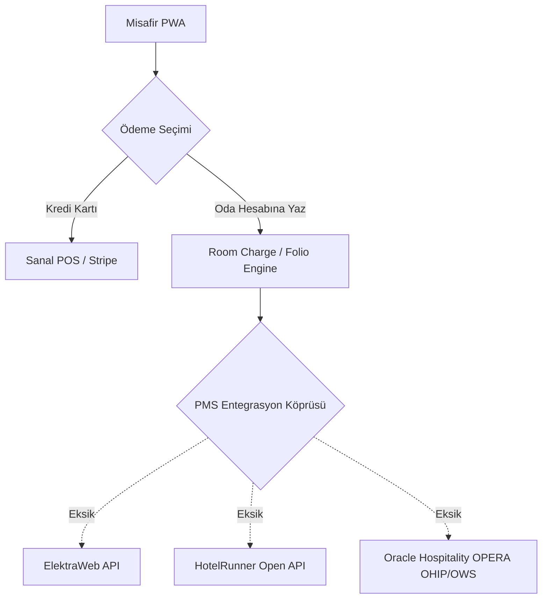
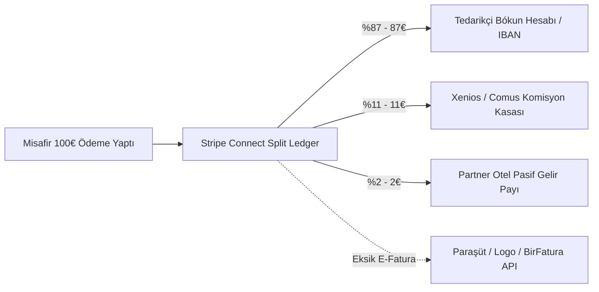

# Xenios Platformu Uçtan Uca Entegrasyon Saha Denetimi ve Eksiklik Analizi (Integration Audit & Gap Analysis)

**Rapor Tarihi:** 2026-08-22  
**Hazırlayan:** Chief Technology Officer (CTO) & Senior Enterprise Integration Architect  
**Hedef Kapsam:** `src/`, `src/app/api/`, `src/services/`, `src/types/`, `src/lib/`, `src/components/`

---

## 1. Yönetici Özeti (Executive Summary)

Xenios platformu; İstanbul lüks turizm ekosisteminde otel içi misafir deneyimi (Guest PWA), partner otel operasyon masası (Hotel Portal) ve merkezi komuta kokpiti (Olympus) arasında köprü kuran hibrit bir mimariye sahiptir.

Son geliştirilen **Tip A (Firebase Native ACID & 10 Dk Kilit)** ve **Tip B (OCTO Standard API Köprüsü)** sayesinde temel aşırı satış (overbooking) koruması donanımsal olarak kurulmuştur. Ancak kurumsal pazara (Enterprise Hotel Chains & Bókun/Viator Operatörleri) tam ölçekte çıkış (**Go-Live**) yapabilmek için; **PMS (Otel Yazılımları)**, **Stripe Connect Hakediş Bölüşümü (Split Payments)**, **E-Fatura Otomasyonu**, **Meta WhatsApp Cloud API** ve **Apple/Google Wallet (.pkpass)** katmanlarında tamamlanması gereken kritik entegrasyonlar bulunmaktadır.

---

## 2. Mevcut & Aktif Entegrasyonlar Tablosu

| Modül / Entegrasyon Noktası | Dosya Konumu | Tip / Protokol | Mevcut Çalışırlık Durumu |
| :--- | :--- | :--- | :--- |
| **OCTO Outbound API (Bókun & FareHarbor)** | `src/services/octoAdapter.ts` | REST API (OCTO v1.0.0) | **Aktif & Çalışır** (Availability Check, Pre-Hold, Create Booking, Cancel) |
| **Native Envanter & ACID Lock Motoru** | `src/services/inventoryEngine.ts` | Firestore ACID Transaction | **Aktif & Çalışır** (10 Dk TTL Kilit, Concurrency Koruma, Otomatik İade) |
| **Stripe / POS Webhook Dinleyicisi** | `src/app/api/webhooks/stripe/route.ts` | Webhook (HTTPS POST) | **Aktif & Çalışır** (lock_id bağlama, Retry Queue, Fallback Alert) |
| **AI Concierge & Şehir Rehberi** | `src/app/api/ai-chat/route.ts` & `src/lib/gemini.ts` | Google Gemini 2.5 Flash / Flash Lite REST API | **Aktif & Çalışır** (3 Katmanlı: Local Cache -> Semantic Cache -> Gemini API) |
| **PWA Web Push Bildirimleri** | `src/lib/pwa-notifications.ts` & `public/sw.js` | Web Push API / Service Worker | **Aktif & Simüle Edilebilir** (VAPID / Local Storage) |
| **Kanal Yönetimi UI Masası** | `src/app/hotel-portal/channels/page.tsx` | UI State & Mock Dispatch | **Kısmi / Yalnızca Ön Yüz** (Backend iCal Parser ve Senkronizasyon Job'ı Eksik) |
| **Fail-Safe Retry & Alert Şablonu** | `src/services/failSafeGuardrails.ts` | Internal Utility & Queue | **Aktif** (3 Denemeli Exponential Backoff; WhatsApp API'ye bağlanmayı bekliyor) |

---

## 3. 5 Ana Katmanda Detaylı Eksiklik Analizi (Gap Analysis)

### Katman A: Deneyim & Turizm Platformları (OTA & Channel Managers)

```mermaid
graph LR
    subgraph Mevcut
        OCTO_Out[OCTO Outbound Adapter] -->|POST /availability| Bokun[Bókun API]
        OCTO_Out -->|POST /bookings| FareHarbor[FareHarbor API]
    end
    
    subgraph Eksik_Gaps
        Bokun -.->|Inbound Webhook eksik| OCTO_In[/api/webhooks/octo]
        GYG[GetYourGuide API] -.->|Doğrudan bağlantı eksik| GYG_Adapter[GYG Supplier v2]
        iCal_Feed[Airbnb / Booking iCal] -.->|Parser eksik| iCal_Worker[/api/channels/ical]
        GTTD[Google Things to Do] -.->|Feed eksik| GTTD_Feed[/api/feeds/gttd]
    end
```

1. **OCTO Inbound Webhooks (`/api/webhooks/octo`):**
   * *Durum:* **Eksik (Risk: YÜKSEK)**
   * *Açıklama:* Dış operatör Bókun veya FareHarbor üzerinden tur saatini değiştirdiğinde veya hava muhalefetiyle turu iptal ettiğinde Xenios'a anlık webhook fırlatan dinleyici eksiktir.
2. **Doğrudan GetYourGuide & Viator Merchant API:**
   * *Durum:* **Orta Seviye İhtiyaç (Risk: ORTA)**
   * *Açıklama:* Büyük acentelerin çoğu Bókun/FareHarbor üzerinden OCTO ile bağlıdır; ancak Bókun kullanmayan doğrudan GYG sağlayıcıları için GYG Supplier API v2 adaptörü hazırda bulunmalıdır.
3. **Airbnb Experiences & iCal 2-Yönlü Motoru:**
   * *Durum:* **Kritik Eksik (Risk: YÜKSEK)**
   * *Açıklama:* Otel portalındaki iCal bağlantıları için `.ics` feed üreten (`/api/channels/ical/[hotelId]/[roomId]/export.ics`) ve dış takvimleri (Airbnb / Booking.com) 15 dakikada bir tarayan backend worker gereklidir.
4. **Google Things to Do (GTTD) Feeds API:**
   * *Durum:* **Fırsat / Büyüme (Risk: DÜŞÜK)**
   * *Açıklama:* Xenios biletlerinin Google Haritalar ve Arama'da doğrudan "Official Site" etiketiyle bilet satabilmesi için GTTD XML/JSON Product Feed uç noktası açılmalıdır.

---

### Katman B: Otel & Konaklama Ekosistemi (Hotel PMS & Room Charge)



1. **Room Charge (Oda Hesabına / Folyoya Yazma):**
   * *Durum:* **Kritik Eksik (Risk: KRİTİK)**
   * *Açıklama:* Lüks otel misafirleri oda içi konsiyerjden satın aldıkları VIP transfer, hamam veya tekne turunu anında kredi kartı girmek yerine "Oda Hesabıma Yaz (Charge to Room 304)" seçeneği ile otel faturasına ekletmek ister. Bu akış için onay mekanizması ve PMS Folio API bağlantısı şarttır.
2. **Yerel & Global PMS Adaptörleri (`src/services/pmsAdapter.ts`):**
   * *Durum:* **Kritik Eksik (Risk: KRİTİK)**
   * *Hedef Sistemler:* 
     * **ElektraWeb API:** Türkiye'deki partner butik ve 5 yıldızlı otellerin %60'ı.
     * **HotelRunner API:** Bağımsız otel ve konaklar.
     * **Opera Cloud (OHIP / OWS):** Uluslararası zincir oteller (Marriott, Hilton, Accor).

---

### Katman C: Finans, Ödeme & Otomatik Komisyon Dağıtımı (Split Payments & Invoicing)



1. **Stripe Connect Custom Accounts / Split Payment:**
   * *Durum:* **Kritik Eksik (Risk: KRİTİK)**
   * *Açıklama:* Xenios'un yasal olarak pazar yeri (marketplace) modelinde çalışabilmesi ve para transferi cezası almaması için misafir ödemesi anında 3'e bölünmelidir:
     * İlan Sağlayıcı: %86 - %89
     * Xenios Komisyonu: %10 - %12
     * Yönlendiren Otel Referans Primi: %1 - %3
   * *Çözüm:* `Stripe.transfers.create` veya `payment_intent` içinde `transfer_data[destination]` & `application_fee_amount` tanımlanmalı; Türkiye için İyzico Pazaryeri API adaptörü eklenmelidir.
2. **E-Fatura & E-Arşiv Otomasyonu (`src/services/eInvoiceService.ts`):**
   * *Durum:* **Yasal Zorunluluk (Risk: KRİTİK)**
   * *Açıklama:* Yapılan her komisyon ve hizmet satışında GİB mevzuatına uygun otomatik E-Arşiv fatura oluşturulması için **Paraşüt API** veya **BirFatura API** entegrasyonu kodlanmalıdır.

---

### Katman D: Misafir İletişimi, Biletleme & Bildirimler

1. **Meta WhatsApp Cloud API (`src/services/whatsappService.ts`):**
   * *Durum:* **Kritik Eksik (Risk: KRİTİK)**
   * *Açıklama:* Turist misafirler e-posta kontrol etmez. Rezervasyon onaylandığı anda barkodlu bilet, iskele konumu (Google Maps pin) ve tur saatinden 2 saat önce hatırlatma doğrudan WhatsApp üzerinden gitmelidir (`https://graph.facebook.com/v19.0/{phone_id}/messages`).
2. **Yerel & Global SMS Gateway (Netgsm / Twilio):**
   * *Durum:* **Orta Seviye (Risk: ORTA)**
   * *Açıklama:* WhatsApp kullanmayan misafirler için yerel Türk numaralarına Netgsm OTP/SMS, yabancı numaralara Twilio SMS fallback hattı kurulmalıdır.
3. **Apple Wallet (`.pkpass`) & Google Wallet Pass:**
   * *Durum:* **Prestij & Deneyim (Risk: ORTA)**
   * *Açıklama:* Misafirin biletini iPhone Cüzdan (Apple Wallet) uygulamasına tek tıkla ekleyebilmesi için `.pkpass` üretim servisi (`passkit-generator`) entegre edilmelidir.

---

### Katman E: Güvenlik, Lisans Teyidi & Observability

1. **TÜRSAB Lisans & Acente Doğrulama:**
   * *Durum:* **Yasal Güvenlik (Risk: ORTA)**
   * *Açıklama:* Kaçak ve korsan tur sağlayıcılarını engellemek adına platforma eklenen acentelerin TÜRSAB A Grubu Seyahat Acentası işletme belgesi numarası teyit edilmelidir.
2. **Sentry & Datadog API Health Observability:**
   * *Durum:* **Teknik Kararlılık (Risk: ORTA)**
   * *Açıklama:* Dış operatörlerin (Bókun, FareHarbor, ElektraWeb, Stripe) API kesintilerini anında yakalayan `@sentry/nextjs` hata izleme sistemi kurulmalıdır.

---

## 4. Eksikliklerin Risk Matrisi ve Önceliklendirme

| Entegrasyon Başlığı | Etkilediği Alan | Risk / Öncelik | İş Etkisi |
| :--- | :--- | :--- | :--- |
| **Stripe Connect Split & Hakediş Dağıtımı** | Finans & Muhasebe | 🔴 **KRİTİK** | Otellere ve tedarikçilere otomatik pay ödenemezse operasyon tıkanır. |
| **Meta WhatsApp Cloud API (Biletleme & Alert)** | Misafir İletişimi | 🔴 **KRİTİK** | Turistlerin bilet ve konum teslimatında ana kanal eksik kalır. |
| **Hotel PMS & Room Charge (ElektraWeb/Opera)** | Otel Operasyonu | 🔴 **KRİTİK** | Resepsiyon ve oda hesabı entegrasyonu olmadan otel zincirleri kabul etmez. |
| **E-Fatura Otomasyonu (Paraşüt / Logo)** | Yasal Mevzuat | 🔴 **KRİTİK** | Satış başı faturalandırma yapılamazsa mali ceza riski doğar. |
| **OCTO Inbound Webhooks (`/webhooks/octo`)** | Envanter Senkronizasyonu | 🟡 **YÜKSEK** | Dışarıdan iptal edilen turlar Xenios'ta açık kalabilir. |
| **iCal 2-Way Calendar Engine (Airbnb/Booking)** | Oda & Kapasite | 🟡 **YÜKSEK** | Butik konakların Airbnb takvimleri manuel yönetilmek zorunda kalır. |
| **Apple Wallet (.pkpass) & Google Pass** | Misafir Deneyimi | 🟢 **ORTA** | VIP misafir deneyimini artırır; olmaması sistemi durdurmaz. |
| **Google Things to Do (GTTD Feed)** | Satış & Pazarlama | 🟢 **DÜŞÜK** | Ekstra doğrudan satış kanalı sağlar. |

---

## 5. Geliştirilmesi Gereken Yeni Servis & API Rota Mimarisi

Aşağıdaki mimari şablonlar ile projenin servis katmanı genişletilmelidir:

```
src/
├── app/
│   └── api/
│       ├── channels/
│       │   └── ical/
│       │       └── [hotelId]/[roomId]/export.ics/route.ts  # [YENİ] iCal RFC 5545 Feed
│       ├── pms/
│       │   └── room-charge/route.ts                      # [YENİ] Oda Hesabına Yazma API
│       ├── webhooks/
│       │   ├── octo/route.ts                             # [YENİ] Bókun/FareHarbor Inbound Webhook
│       │   └── pms/route.ts                              # [YENİ] PMS Folio & Check-in Webhook
│       └── wallet/
│           └── [bookingId]/pass.pkpass/route.ts          # [YENİ] Apple Wallet Üretim Endpoint'i
├── services/
│   ├── pmsAdapter.ts                                     # [YENİ] ElektraWeb, HotelRunner, Opera
│   ├── splitPayoutService.ts                             # [YENİ] Stripe Connect %87/%11/%2 Dağıtımı
│   ├── eInvoiceService.ts                                # [YENİ] Paraşüt / BirFatura API
│   ├── whatsappService.ts                                # [YENİ] Meta WhatsApp Cloud API
│   ├── icalSyncService.ts                                # [YENİ] 2-Way iCal Parser & Engine
│   └── passKitService.ts                                 # [YENİ] Apple Wallet .pkpass Generator
```

---

## 6. Önceliklendirilmiş Yol Haritası (Sprint Planı)

### Sprint 1: Finans, Hakediş & Misafir İletişimi (1. - 2. Hafta)
1. **Stripe Connect / Split Payment Motoru (`splitPayoutService.ts`):** Satış anında %87 Tedarikçi, %11 Xenios, %2 Otel komisyon dağıtımının kodlanması.
2. **Meta WhatsApp Cloud API Entegrasyonu (`whatsappService.ts`):** Satın alma anında bilet PDF'i, QR kod ve Google Maps konumunun turiste anında WhatsApp ile iletilmesi.
3. **E-Fatura Servisi (`eInvoiceService.ts`):** Satış anında Paraşüt/BirFatura üzerinden E-Arşiv fatura tanzimi.

### Sprint 2: Otel PMS & Inbound Webhook Katmanı (3. - 4. Hafta)
1. **Hotel PMS Entegrasyon Köprüsü (`pmsAdapter.ts`):** ElektraWeb ve HotelRunner API ile "Room Charge" (Oda Folyosuna İşleme) yeteneği.
2. **OCTO Inbound Webhook Dinleyicisi (`/api/webhooks/octo`):** Bókun ve FareHarbor'dan gelen iptal ve saat değişikliklerinin anında Firestore'a işlenmesi.
3. **iCal 2-Yönlü Senkronizasyon:** Airbnb ve Booking.com takvimlerinin odaya bağlanması.

### Sprint 3: Prestij, Biletleme & Global Dağıtım (5. Hafta)
1. **Apple Wallet (`.pkpass`) & Google Pass:** Misafirlerin biletlerini telefon cüzdanına eklemesi.
2. **Google Things to Do Feeds API:** Google Arama & Haritalar'a resmi bilet bağlantısı verilmesi.
3. **Sentry APM & Observability:** Dış API çağrılarının anlık sağlık monitörüne bağlanması.
